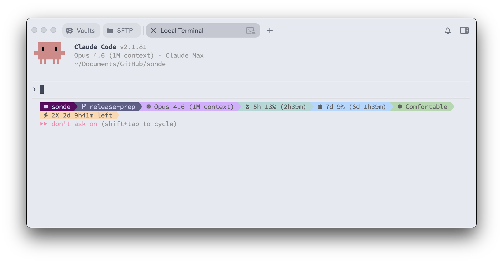
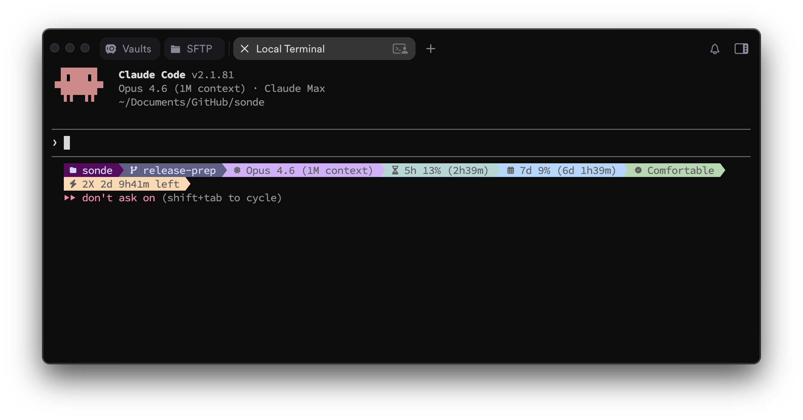
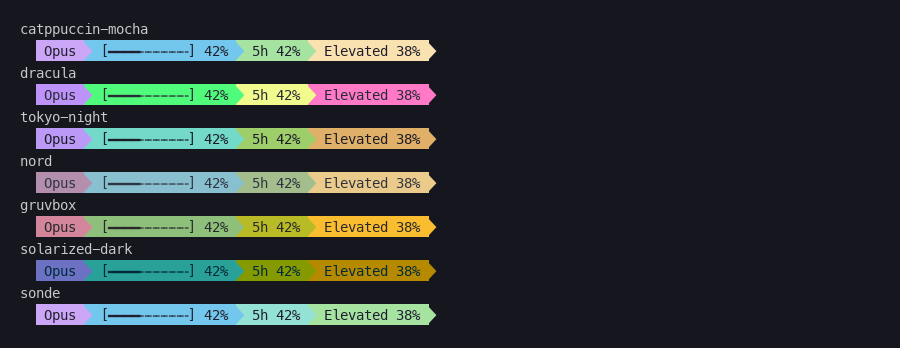

<p align="center">
  
</p>

<p align="center">
  <strong>Know when you're about to get rate-limited. Before it happens.</strong>
</p>

<p align="center">
  <a href="#the-one-thing-no-other-tool-does">Why Sonde</a> &bull;
  <a href="#install">Install</a> &bull;
  <a href="#the-menu-bar-app">Menu Bar App</a> &bull;
  <a href="#the-terminal-statusline">Terminal Statusline</a> &bull;
  <a href="#themes">Themes</a>
</p>

<p align="center">
  
  
  
  
  
</p>

---

<p align="center">
  
  <br>
  <sub>Hero wallpaper: "Everyone-can-fly" by Adrian Slazok — <a href="https://www.comedywildlifephoto.com/">Comedy Wildlife Photography Awards</a></sub>
</p>

---

## The one thing no other tool does

Claude Code runs **2X capacity promotions** during off-peak hours. Your rate limits literally double. But Anthropic doesn't send push notifications about them — you'd have to check their support page manually.

**sonde tracks this for you.** It knows when 2X is active, how long it lasts, and adjusts your pacing predictions automatically. No more guessing whether it's safe to go heavy on a coding session.

> **How it works:** sonde monitors the [PromoClock API](https://promoclock.co) and cross-references it with your real-time usage from Claude Code's OAuth API. When 2X is active and you're at 50% usage, sonde knows you're effectively at 25% burn rate — so it tells you to keep going instead of slowing down.

### Current 2X schedule
- **Weekdays**: Before 8 AM and after 2 PM (your local time)
- **Weekends**: All day Saturday and Sunday

sonde detects this automatically. Zero configuration.

---

## But it does a lot more than promos

You're deep in a coding session. Claude is on fire. Then suddenly — rate limited. No warning. No countdown. Just... stopped.

**sonde** is the fuel gauge for your AI coding tools. It sits in your menu bar and terminal, continuously showing you exactly where you stand — usage, pacing, time-to-limit, active sessions, and more.

> **sonde** (noun, /sɒnd/) — a device sent into the atmosphere to transmit measurements back to the observer. Just like a weather sonde reports conditions from the sky, sonde reports the conditions of your AI usage in real-time.

---

## Install

### Menu Bar App (macOS) — most users start here

Download **[Sonde.dmg](https://github.com/ronrefael/sonde/releases/latest/download/Sonde.dmg)** from the [latest release](https://github.com/ronrefael/sonde/releases), open it, drag **Sonde** into **Applications**, and launch. That's it.

On first launch, a guided setup walks you through everything — Claude Code detection, auth, statusline config, font install, and theme selection. No terminal commands needed.

> **macOS Gatekeeper warning?** Since sonde isn't notarized with Apple yet, macOS may block the first launch. To open it: **right-click** (or Control+click) Sonde.app → **Open** → click **Open** in the dialog. You only need to do this once.

> **What about the .tar.gz files on the release page?** Those are the standalone terminal statusline binary (no GUI app). Most Mac users just need the DMG. The tar.gz files are for Linux users or people who only want the Claude Code statusline without the menu bar dashboard.
>
> | File | Who it's for |
> |------|-------------|
> | **Sonde.dmg** | Mac users — the full menu bar app + dashboard |
> | sonde-aarch64-apple-darwin.tar.gz | Mac (Apple Silicon) — terminal binary only |
> | sonde-x86_64-apple-darwin.tar.gz | Mac (Intel) — terminal binary only |
> | sonde-x86_64-unknown-linux-gnu.tar.gz | Linux x64 — terminal binary only |
> | sonde-aarch64-unknown-linux-gnu.tar.gz | Linux ARM — terminal binary only |

### Terminal Statusline (macOS / Linux)

The terminal statusline is also included inside the DMG app. But if you want it standalone:

```bash
# Homebrew (recommended)
brew install ronrefael/tap/sonde

# Or one-liner
curl -sSf https://raw.githubusercontent.com/ronrefael/sonde/main/install.sh | bash

# Or from source
cargo install --git https://github.com/ronrefael/sonde --locked
```

Then run:

```bash
sonde setup    # Auto-configures everything in ~10 seconds
sonde doctor   # Verify all 9 checks pass
```

```
sonde doctor

  ✔ Claude Code installed        ✔ OAuth token available
  ✔ Usage API reachable          ✔ Promo API reachable
  ✔ Config file found            ✔ Config file valid
  ✔ Cache directory writable     ✔ Terminal colors
  ✔ Nerd Font glyphs

  9/9 checks passed
```

---

## The menu bar app

A native macOS app that lives in your menu bar. One glance tells you everything:

<p>
  
  &nbsp;&nbsp;
  
</p>

Click to open the full dashboard:

<p>
  
  
</p>

### What you see at a glance

| | |
|---|---|
| **Usage rings** | 5-hour and 7-day utilization with color-coded gauges |
| **Pacing tier** | Comfortable → On Track → Elevated → Hot → Critical → Runaway |
| **Time-to-limit** | "At this rate, you'll hit your limit in ~2h 15m" |
| **Promo badge** | ⚡ 2X Active · 2d 10h left |
| **Active sessions** | All running Claude sessions with model, project, and duration |
| **Code activity** | Lines added/removed, net change, wait percentage |
| **7-day chart** | Daily peak usage bar chart with backfilled history |
| **Context bar** | Visual progress of your context window usage |

### Guided onboarding

First launch walks you through everything. Zero terminal commands.

<p>
  
  
  
  
</p>
<p>
  
  
  
</p>

### Configurable menu bar

Every segment is toggleable in Settings. Pick your timer mode:

| Mode | Example |
|------|---------|
| 5h time left | `3h21m` |
| 5h elapsed | `1h39m` |
| 5h resets at | `2:30 PM` |
| 7d time left | `3d 12h` |
| 7d resets at | `Mon 8:00 AM` |
| Promo time left | `12h30m` |
| Session duration | `2h 14m` |

---

## The terminal statusline

A Rust-powered statusline that renders directly inside Claude Code:

<p>
  
</p>
<p>
  
</p>

Renders in under 50ms (~30ms on Apple Silicon). Every segment is a configurable module:

| Module | What it shows |
|--------|---------------|
| Project | Current project name |
| Git branch | Active branch |
| Model | Opus 4.6, Sonnet 4.6, Haiku 4.5 |
| 5h usage | Utilization + reset countdown |
| 7d usage | Weekly utilization + reset countdown |
| Pacing | 6-tier burn rate with time-to-limit |
| Promo badge | 2X status with countdown |
| Context bar | Visual progress bar of context window |
| Active sessions | Count of parallel Claude sessions |
| Session clock | Elapsed session time |
| Custom | Your own shell command modules |

---

## Themes

### Menu bar app — 7 themes

| | | |
|:---:|:---:|:---:|
| <br>**Liquid Glass** | <br>**System Light** | <br>**System Dark** |
| <br>**Terminal** | <br>**Cyberpunk** | <br>**Synthwave** |
| <br>**Solar Flare** | <br>**Settings (Light)** | <br>**Settings (Dark)** |

### Terminal — 7 powerline palettes



```bash
sonde themes    # Preview all palettes in your terminal
```

Set in `sonde.toml`: `theme = "dracula"` — options: catppuccin-mocha (default), dracula, tokyo-night, nord, gruvbox, solarized-dark, sonde.

---

## Configuration

sonde looks for config in this order:

1. `$SONDE_CONFIG` environment variable
2. `./sonde.toml` (project-local)
3. `~/.config/sonde/sonde.toml` (XDG)
4. `~/.sonde.toml` (home fallback)

### Custom modules

```toml
[sonde.custom.cpu]
command = "top -l 1 | awk '/CPU usage/ {print $3}'"
style   = "fg:#7dcfff"
```

Use as `$sonde.custom.cpu` in your `lines` config.

### Webhook notifications

```toml
[sonde.notifications]
webhook_url        = "https://hooks.slack.com/services/T.../B.../..."
thresholds         = [80.0, 95.0]
rate_limit_minutes = 5
```

Auto-detects Slack, Discord, or generic webhook format. Get pinged before you hit the wall.

---

## How it works

sonde reads Claude Code's OAuth token from your system keychain (never stored to disk), calls the usage API, caches results for 60 seconds, and renders everything in real-time.

**Security**: Your OAuth token never touches disk, logs, cache, or stdout. It's held in memory only for the duration of the API call, then dropped. We're paranoid about this.

---

## Commands

| Command | What it does |
|---------|-------------|
| `sonde` | Render statusline (reads JSON from stdin) |
| `sonde setup` | Auto-configure everything in ~10 seconds |
| `sonde doctor` | Run 9 diagnostic checks |
| `sonde tui` | Full-screen terminal dashboard |
| `sonde themes` | Preview all 7 terminal palettes |
| `sonde configure` | Interactive TUI configurator |
| `sonde version` | Print version |

---

## What's next

- VS Code extension
- Raycast extension (quick view from launcher)
- Apple Watch complication (usage ring on your wrist)
- iOS companion app
- Landing page

---

## License

MIT

---

<p align="center">
  Built with obsessive attention to detail by developers who got rate-limited one too many times.
</p>
