<p align="center">
  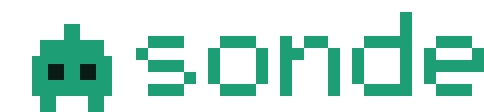
</p>

<p align="center">
  <em>Your AI coding copilot's copilot.</em>
</p>

<p align="center">
  <a href="#install">Install</a> &bull;
  <a href="#what-you-get">What You Get</a> &bull;
  <a href="#the-menu-bar-app">Menu Bar App</a> &bull;
  <a href="#the-terminal-statusline">Terminal Statusline</a> &bull;
  <a href="#promo-awareness">Promo Awareness</a> &bull;
  <a href="#themes">Themes</a>
</p>

<p align="center">
  
  
  
  
</p>

---

<p align="center">
  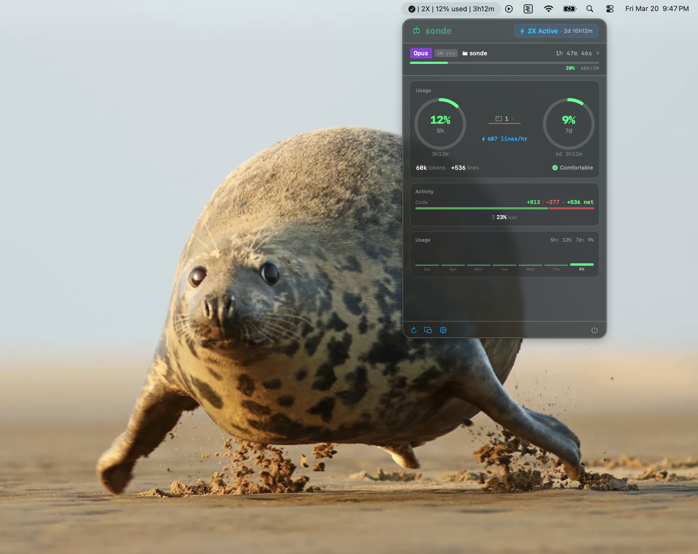
</p>

## Why sonde exists

You're deep in a coding session. Claude is on fire. Then suddenly — rate limited. No warning. No countdown. Just... stopped.

**sonde** fixes that. It sits in your menu bar and terminal, continuously monitoring your AI usage so you always know exactly where you stand. Think of it as the fuel gauge for your AI coding tools.

> **sonde** (noun, /sɒnd/) — a device sent into the atmosphere to transmit measurements back to the observer. Just like a weather sonde reports conditions from the sky, sonde reports the conditions of your AI usage in real-time.

## What you get

**Two interfaces, one mission:**

### The Menu Bar App
A native macOS app that lives in your menu bar. One glance tells you everything:

<p>
  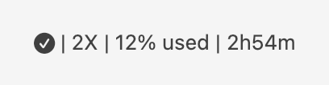
  &nbsp;&nbsp;
  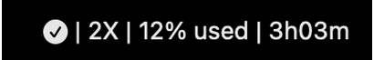
</p>

Click to open a full dashboard with:
- **Usage gauges** — 5-hour and 7-day utilization rings
- **Pacing prediction** — "At this rate, you'll hit your limit in ~2h 15m"
- **7-day usage chart** — bar chart showing your daily peak usage
- **Active sessions** — see all your running Claude sessions across projects
- **Promo status** — know exactly when 2X capacity is active and how long it lasts
- **7 themes** — Liquid Glass, System, Sonde, Terminal, Cyberpunk, Synthwave, Solar Flare
- **Configurable settings** — customize what shows in the menu bar, pick your timer mode, choose your theme

<p>
  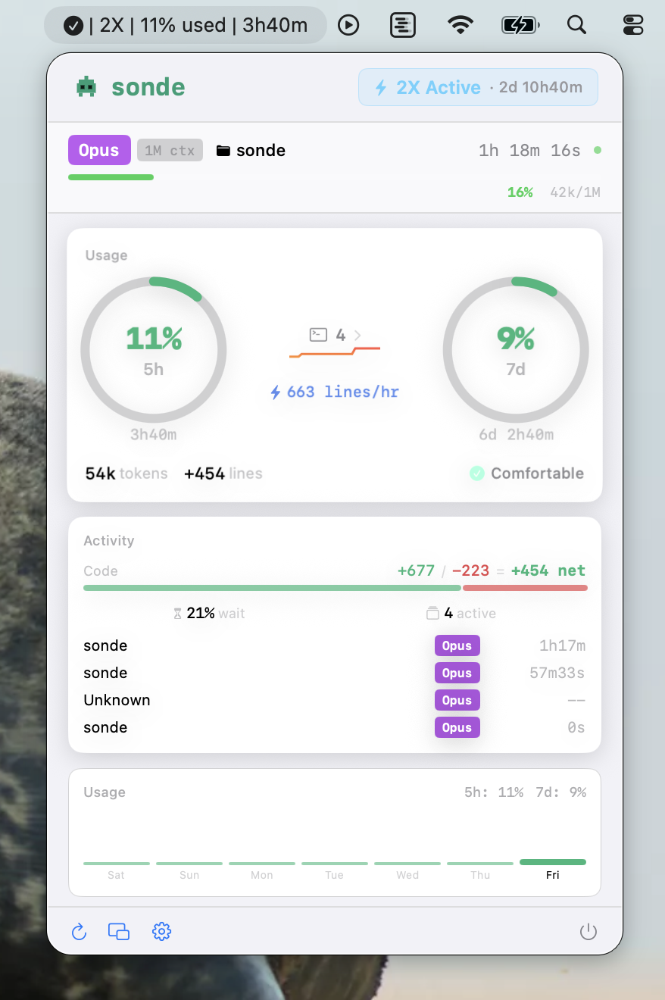
  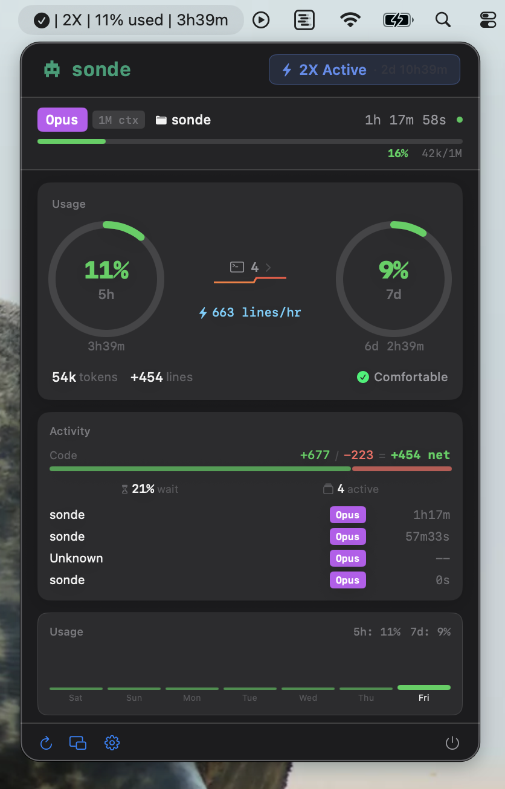
</p>

### The Terminal Statusline
A Rust-powered statusline that renders directly in Claude Code:

```
 Opus  2h14m  [████░░░░░░] 42%  5h 20% (3h41m)  7d 39% (81h41m)   92%
 ⚡ 2X  10h32m left
```

20+ configurable modules. Renders typically under 50ms (~30ms measured on Apple Silicon). Powerline arrows with 6 color themes.

## Promo awareness

This is sonde's killer feature. **No other tool does this.**

Claude Code runs promotions where your rate limits are doubled (2X) during off-peak hours. These promotions aren't announced with push notifications — you'd never know unless you checked the support page manually.

sonde knows. It tracks the current promotion schedule and tells you:

- **Whether a promo is active right now** — `⚡ 2X Active · 12h30m`
- **How long until it ends** — so you can plan your heavy coding sessions
- **Your effective pacing** — pacing adjusts automatically during promos (50% usage during 2X = effectively 25% burn rate)
- **Time-to-limit prediction** — "~2h 15m to limit" accounts for promo multipliers

### Current Promo Schedule
Claude Code's 2X capacity promotion is active during **off-peak hours**:
- **Weekdays**: Before 8 AM and after 2 PM (your local time)
- **Weekends**: All day Saturday and Sunday

sonde detects this automatically. No configuration needed.

## Install

### Menu Bar App (macOS)

Download `Sonde.dmg` from the [latest release](https://github.com/ronrefael/sonde/releases), open it, and drag **Sonde** into **Applications**.

### Terminal Statusline

#### Homebrew (macOS/Linux)

```bash
brew install ronrefael/tap/sonde
```

#### From source

```bash
cargo install --git https://github.com/ronrefael/sonde --locked
```

#### Quick install script

```bash
curl -sSf https://raw.githubusercontent.com/ronrefael/sonde/main/install.sh | bash
```

#### Build locally

```bash
git clone https://github.com/ronrefael/sonde && cd sonde
cargo build --release
# Binary at target/release/sonde
```

## Quick start

### Option 1: Auto-setup (recommended)

```bash
sonde setup
```

Detects Claude Code, validates your OAuth token, writes the statusline config. Done in 10 seconds.

### Option 2: Manual setup

Add to `~/.claude/settings.json`:

```json
{
  "statusLine": {
    "command": "sonde"
  }
}
```

### Verify everything works

```bash
sonde doctor
```

Runs 9 diagnostic checks: Claude Code installed, OAuth token, API connectivity, config validity, cache permissions, terminal colors, and Nerd Font glyphs.

## The menu bar app

### First launch: guided onboarding

On first launch, sonde walks you through a 7-step setup wizard. No terminal commands needed — everything configures itself.

<p>
  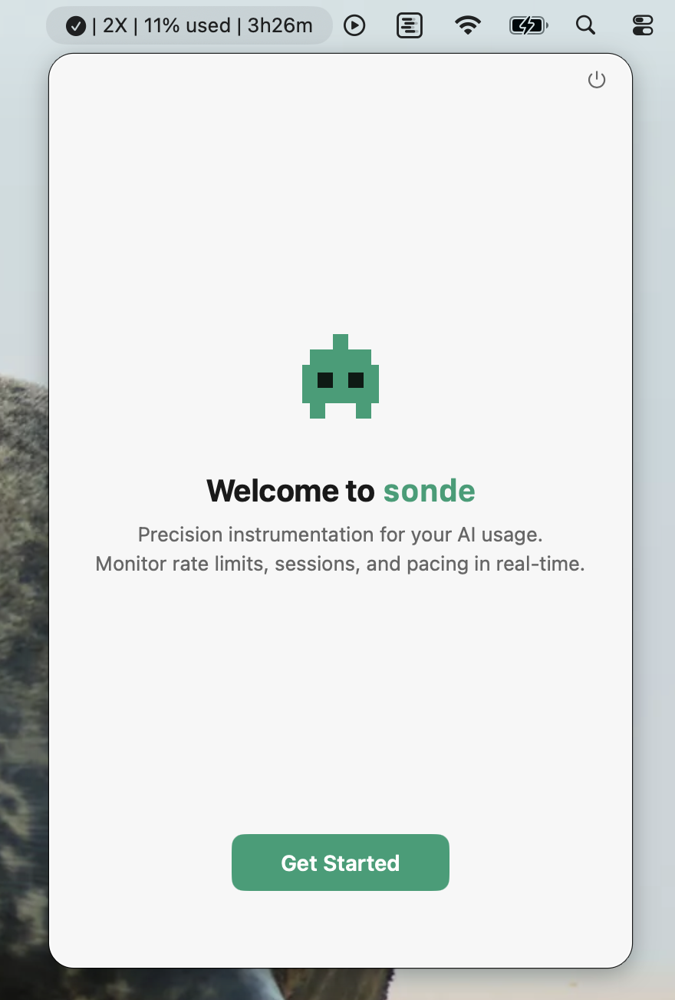
  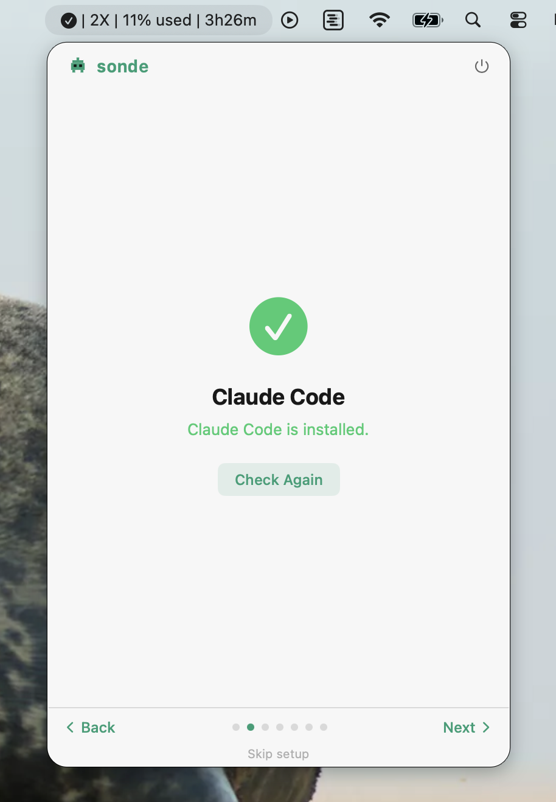
  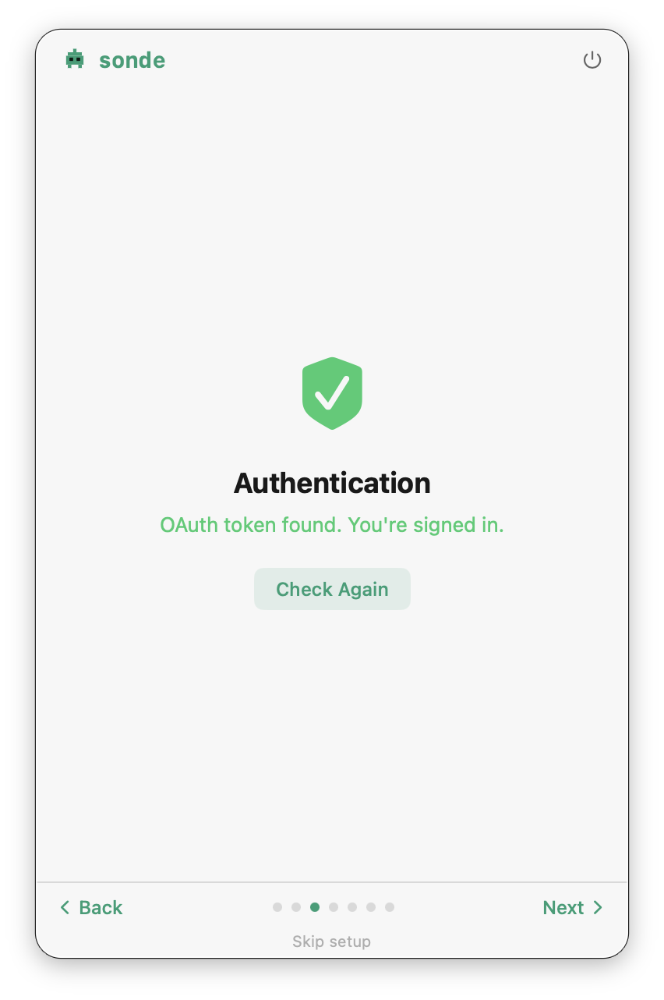
  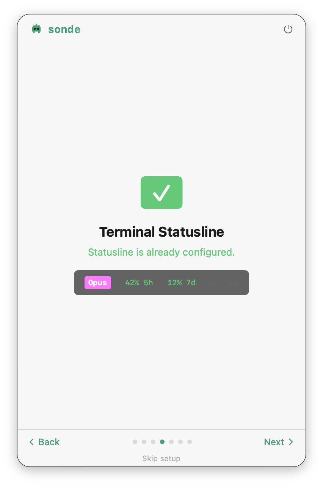
</p>
<p>
  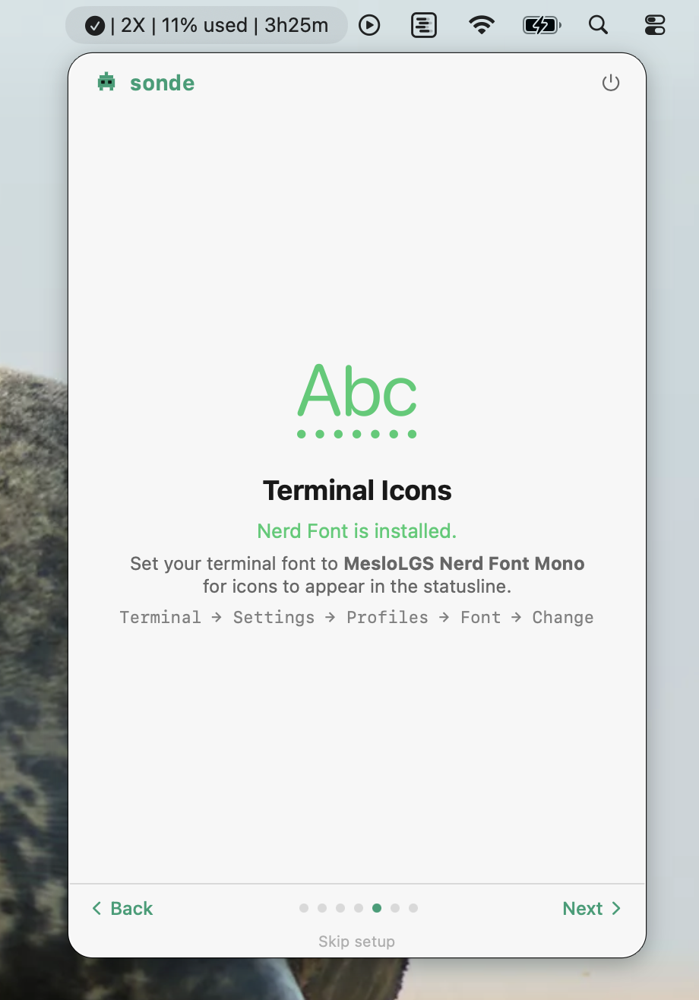
  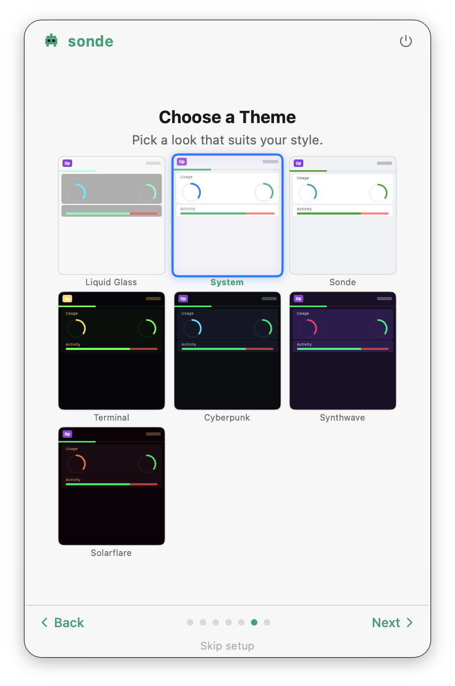
  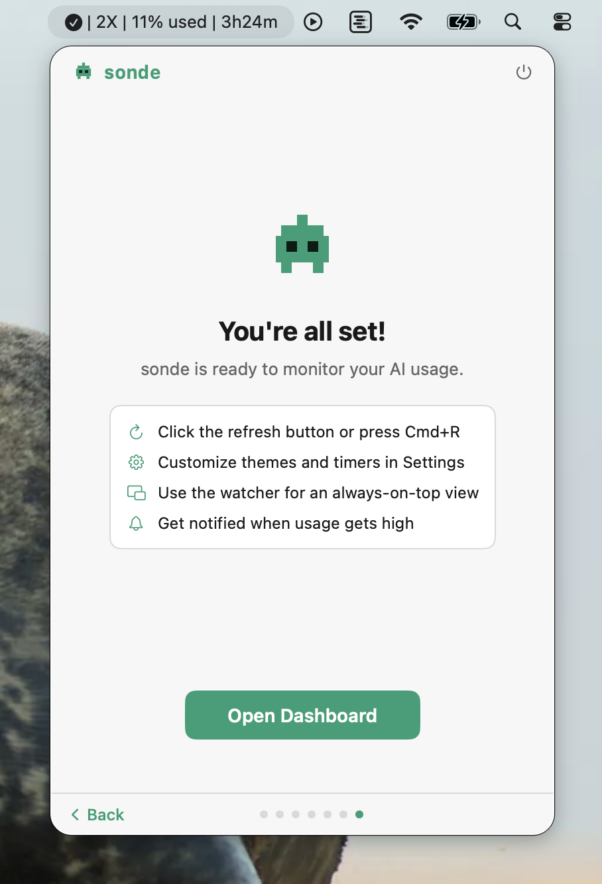
</p>

### Dashboard features

| Feature | Description |
|---------|-------------|
| **Usage gauges** | 5-hour and 7-day utilization with color-coded rings |
| **Pacing tier** | Comfortable → On Track → Elevated → Hot → Critical → Runaway |
| **Time-to-limit** | Predicts when you'll hit your rate limit at current pace |
| **7-day chart** | Daily peak usage bar chart with backfilled history |
| **Active sessions** | All running Claude sessions with project, model, and duration |
| **Promo badge** | 2X status with countdown timer |
| **Context bar** | Visual progress bar of context window usage |
| **Session info** | Model, project name, git branch, session duration |

### Menu bar display

Configurable via Settings. Each segment can be toggled:

| Segment | Example | Toggle |
|---------|---------|--------|
| Pace icon | ✓ | Always on |
| Promo multiplier | 2X | Show promo status |
| Remaining % | 92% | Always on |
| Timer | 3h21m | Show timer |

### Timer modes

| Mode | Shows | Example |
|------|-------|---------|
| 5h time left | Countdown to 5h window reset | `3h21m` |
| 5h elapsed | Time spent in current window | `1h39m` |
| 5h resets at | Clock time of next reset | `2:30 PM` |
| 7d time left | Countdown to 7d window reset | `3d 12h` |
| 7d resets at | Clock time of 7d reset | `Mon 8:00 AM` |
| Promo time left | Promo countdown (only during promo) | `12h30m` |
| Session duration | Current session time | `2h 14m` |

### Build from source

```bash
cd SondeApp && make bundle && open build/Sonde.app
```

To create an installer DMG:

```bash
cd SondeApp && make dmg && open build/Sonde.dmg
```

## The terminal statusline

### Modules

| Module | Token | Description |
|--------|-------|-------------|
| Model | `$sonde.model` | Current model (Opus, Sonnet, Haiku) |
| Context bar | `$sonde.context_bar` | Visual progress bar [━━━━╌╌╌╌╌╌] |
| Usage limits | `$sonde.usage_limits` | 5h and 7d utilization with reset countdowns |
| Pacing | `$sonde.pacing` | 6-tier burn rate with time-to-limit prediction |
| Promo badge | `$sonde.promo_badge` | 2X status with countdown |
| Session clock | `$sonde.session_clock` | Elapsed session time |
| Git branch | `$sonde.git_branch` | Current git branch |
| Active sessions | `$sonde.active_sessions` | Count of parallel Claude sessions |
| Agent | `$sonde.agent` | Agent name badge |
| Worktree | `$sonde.worktree` | Worktree name |
| Mascot | `$sonde.mascot_icon` | Animated status icon |
| Custom | `$sonde.custom.{name}` | Your own shell command modules |

### Pacing tiers

| Tier | Utilization | What it means |
|------|-------------|---------------|
| Comfortable | < 30% | Cruise control. Use freely. |
| On Track | 30-60% | Normal pace. You're fine. |
| Elevated | 60-80% | Picking up speed. Be aware. |
| Hot | 80-100% | Slow down or you'll hit the wall. |
| Critical | >= 100% | You're at the limit. |
| Runaway | > 90% absolute | Even promo can't save you. |

## Themes

### Menu bar app (7 themes)

| | | |
|:---:|:---:|:---:|
| 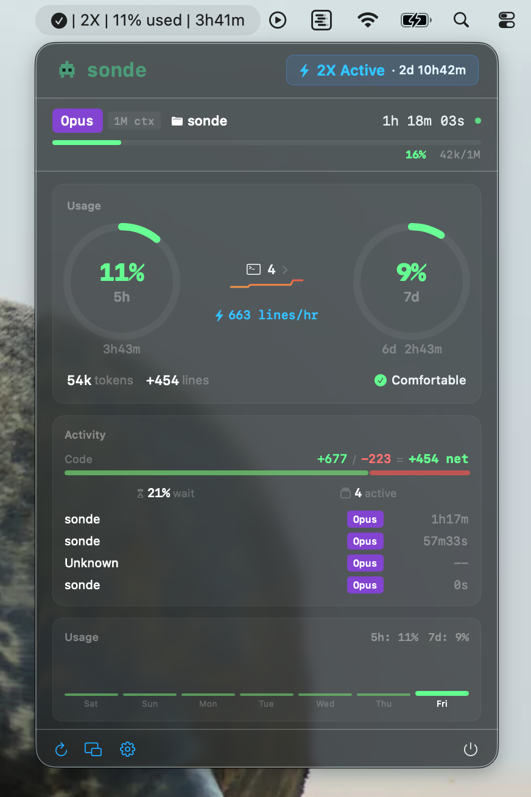<br>**Liquid Glass** | <br>**System Light** | <br>**System Dark** |
| 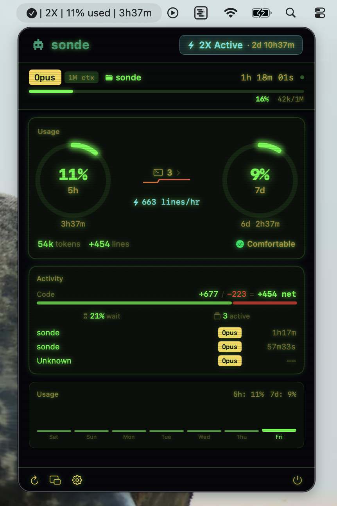<br>**Terminal** | 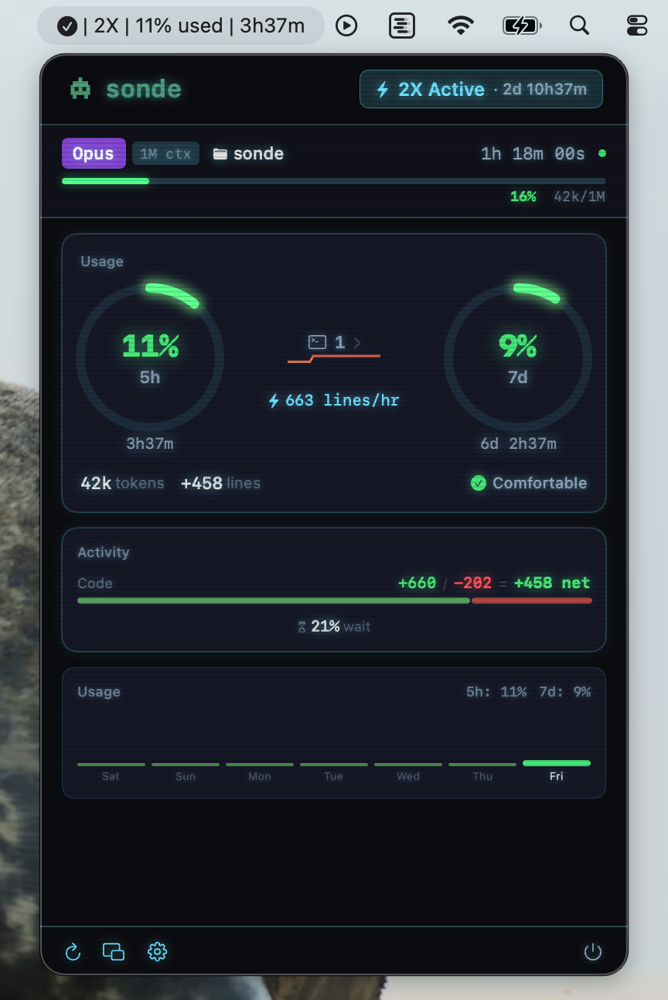<br>**Cyberpunk** | 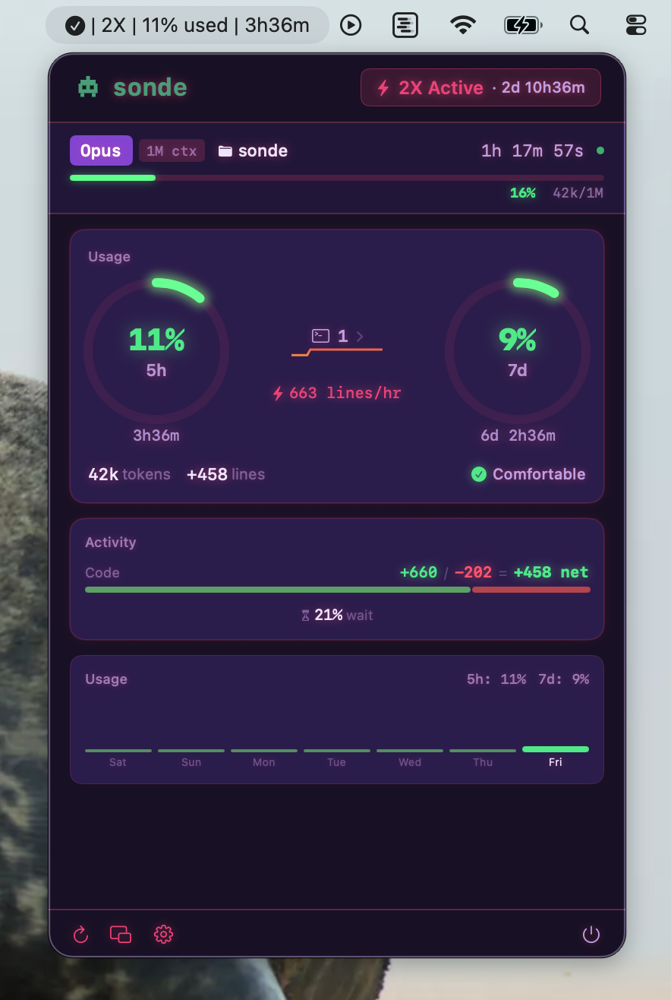<br>**Synthwave** |
| 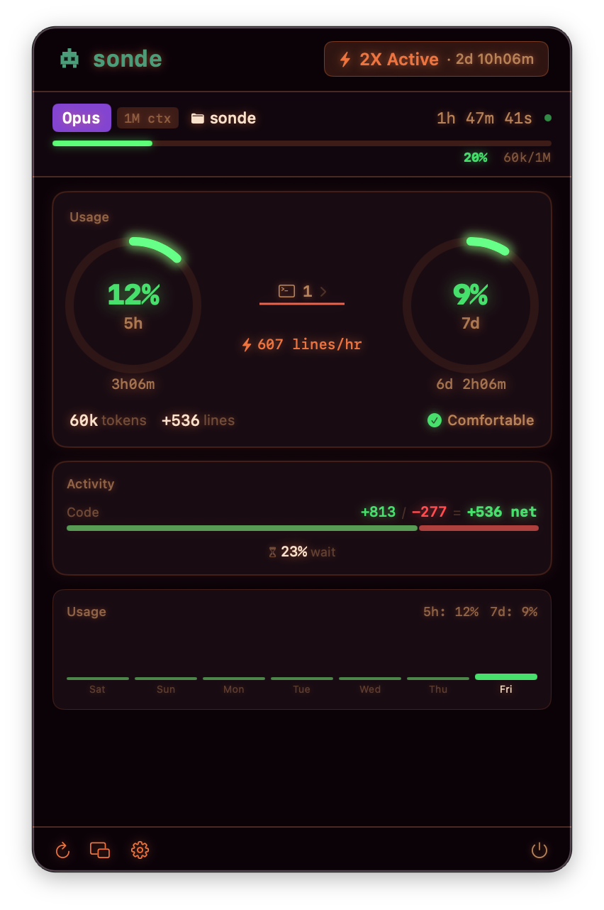<br>**Solar Flare** | 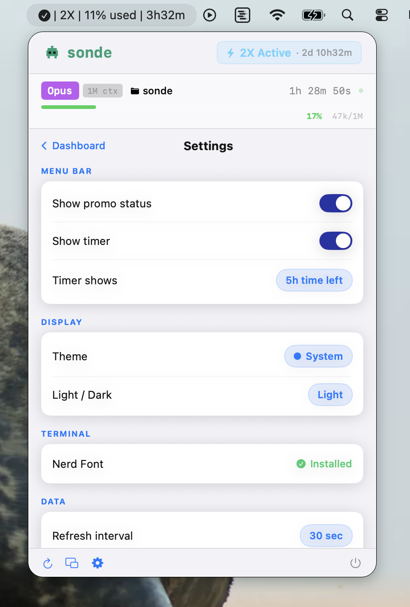<br>**Settings (Light)** | 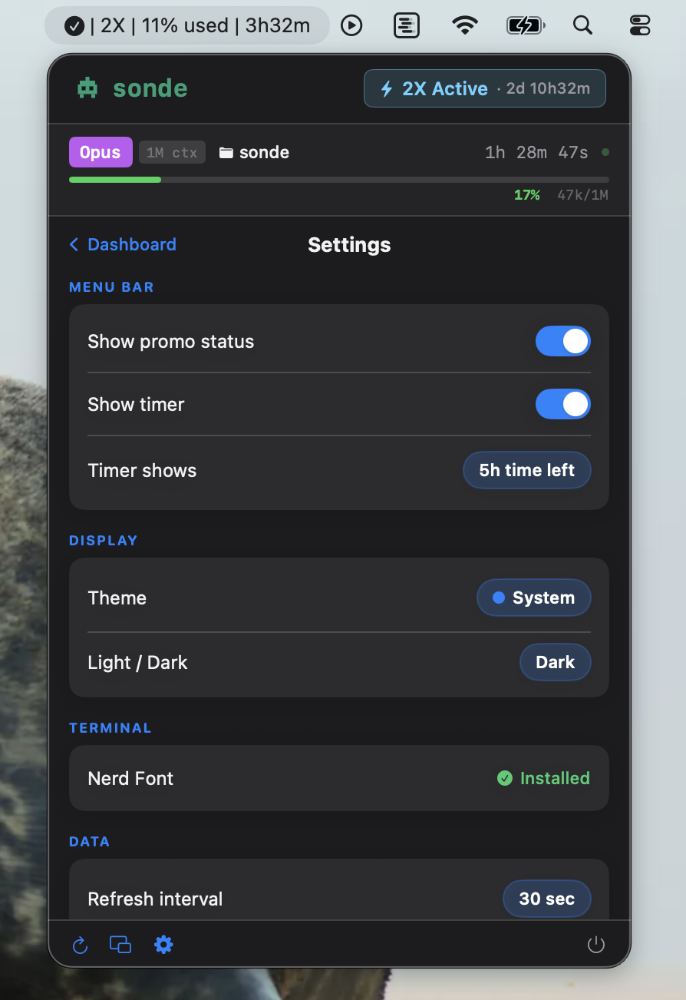<br>**Settings (Dark)** |

### Terminal (6 powerline palettes)

```bash
sonde themes    # Preview all palettes
```

Set in config: `theme = "dracula"` — options: catppuccin-mocha (default), dracula, tokyo-night, nord, gruvbox, solarized-dark.

## Commands

| Command | Description |
|---------|-------------|
| `sonde` | Render statusline (reads JSON from stdin) |
| `sonde tui` | Full-screen terminal dashboard |
| `sonde setup` | Interactive setup wizard |
| `sonde doctor` | System health check (9 diagnostics) |
| `sonde themes` | Preview all 6 terminal palettes |
| `sonde configure` | Interactive TUI configurator |
| `sonde version` | Print version |

## Configuration

sonde looks for config in this order:

1. `$SONDE_CONFIG` environment variable
2. `./sonde.toml` (project-local)
3. `~/.config/sonde/sonde.toml` (XDG)
4. `~/.sonde.toml` (home fallback)

### Custom modules

```toml
[sonde.custom.cpu]
command = "top -l 1 | awk '/CPU usage/ {print $3}'"
style   = "fg:#7dcfff"
```

Use as `$sonde.custom.cpu` in your `lines` config.

### Webhook notifications

```toml
[sonde.notifications]
webhook_url        = "https://hooks.slack.com/services/T.../B.../..."
thresholds         = [80.0, 95.0]
rate_limit_minutes = 5
```

Auto-detects Slack, Discord, or generic webhook format.

## How it works

sonde reads Claude Code's OAuth token from your system keychain (never stored to disk), calls the usage API, caches results for 60 seconds, and renders everything in real-time. The Rust binary renders typically under 50ms. The Swift app polls every 30 seconds (configurable).

**Security**: Your OAuth token is never written to disk, logs, cache, or stdout. It's held in memory only for the duration of the API call, then dropped.

## Debugging

```bash
# Verbose logging
echo '{"model":{"display_name":"Opus"}}' | RUST_LOG=debug sonde

# Run diagnostics
sonde doctor

# Preview themes
sonde themes
```

## What's next

- VS Code extension (coming soon)
- Raycast extension (quick view from launcher)
- Apple Watch complication (usage ring on your wrist)
- Landing page (coming soon)

## License

MIT

---

<p align="center">
  Built with obsessive attention to detail by developers who got rate-limited one too many times.
</p>
