<p align="center">
  
</p>

<p align="center">
  <strong>Local-first Claude Code usage, pacing, and per-project session insight.</strong>
</p>

<p align="center">
  <sub>Rust statusline + native macOS menu bar app. No telemetry. No accounts.</sub>
</p>

<p align="center">
  <sub><strong>sonde</strong> (noun, /sɒnd/) · <em>a device sent into the atmosphere to transmit measurements back to the observer</em></sub>
  <br>
  <sub><em>Just like a weather sonde reports conditions from the sky, sonde reports the conditions of your AI usage in real-time.</em></sub>
</p>

<p align="center">
  <a href="#what-sonde-does">What Sonde does</a> &bull;
  <a href="#install">Install</a> &bull;
  <a href="#the-menu-bar-app">Menu Bar App</a> &bull;
  <a href="#the-terminal-statusline">Terminal Statusline</a> &bull;
  <a href="#themes">Themes</a>
</p>

<p align="center">
  
  
  
  
  
</p>

---

<p align="center">
  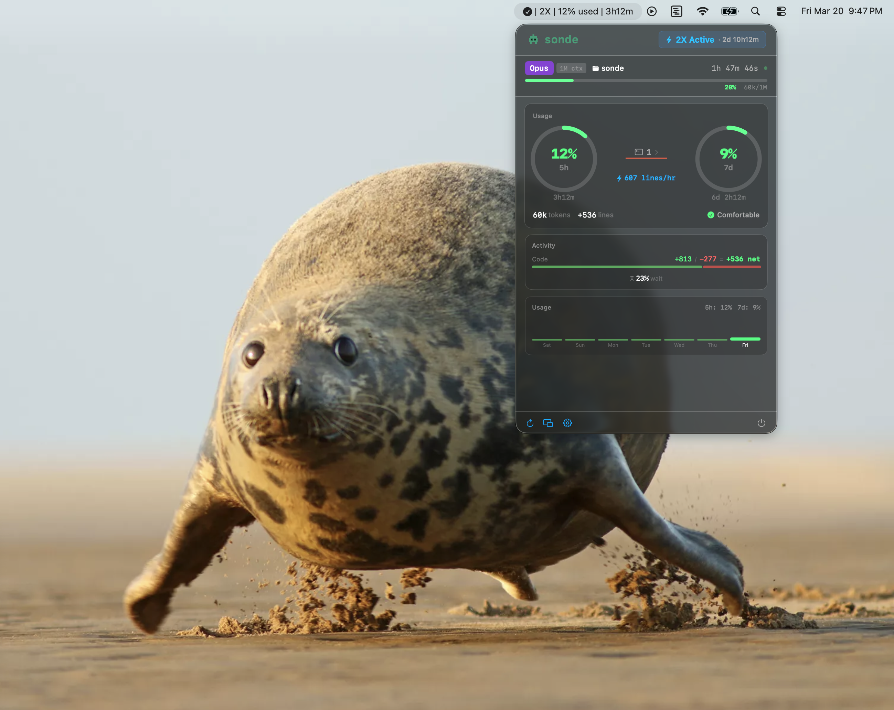
  <br>
  <sub>Hero wallpaper: "Everyone-can-fly" by Adrian Slazok, <a href="https://www.comedywildlifephoto.com/">Comedy Wildlife Photography Awards</a></sub>
</p>

---

## What Sonde does

Sonde reads the JSON Claude Code already pipes to its statusline (including the
`rate_limits` field added in Claude Code v2.1.80 on 2026-03-19) and your local
session transcripts under `~/.claude/projects/`, then renders:

- **Real-time 5-hour and 7-day rate-limit usage**, sourced from the harness's
  stdin field when available. No paid API calls.
- **Pacing tier with time-to-limit estimate**, based on your local history.
- **Per-project session analytics** — tokens, cache reads/writes, message
  counts — computed from the JSONL transcripts on disk.
- **Context-window progress bar** for the active session.
- **Active-session count** across your running Claude Code projects.

Claude Code occasionally runs capacity promotions; Sonde will surface one if
it's active, but this is no longer the headline feature — Anthropic permanently
raised baseline 5-hour limits for Pro/Max in May 2026.

---

## Install

### Menu Bar App (macOS)

Download **[Sonde.dmg](https://github.com/ronrefael/sonde/releases/latest/download/Sonde.dmg)** from the [latest release](https://github.com/ronrefael/sonde/releases), open it, drag **Sonde** into **Applications**, and launch. That's it.

On first launch, a guided setup walks you through everything: Claude Code detection, auth, statusline config, font install, and theme selection. No terminal commands needed.

> **macOS Gatekeeper warning?** Since sonde isn't notarized with Apple yet, macOS will block the first launch. To fix it, run this once in Terminal:
> ```bash
> xattr -cr /Applications/Sonde.app
> ```
> Then open Sonde normally. You only need to do this once.

> **What about the .tar.gz files on the release page?** Those are the standalone terminal statusline binary (no GUI app). Most Mac users just need the DMG. The tar.gz files are for Linux users or people who only want the Claude Code statusline without the menu bar dashboard.
>
> | File | Who it's for |
> |------|-------------|
> | **Sonde.dmg** | Mac users, the full menu bar app + dashboard |
> | sonde-aarch64-apple-darwin.tar.gz | Mac (Apple Silicon M1+), terminal binary only |
> | sonde-x86_64-apple-darwin.tar.gz | Mac (Intel), terminal binary only |
> | sonde-x86_64-unknown-linux-gnu.tar.gz | Linux x64, terminal binary only |
> | sonde-aarch64-unknown-linux-gnu.tar.gz | Linux ARM, terminal binary only |

### Terminal Statusline (macOS / Linux)

```bash
# Homebrew (recommended)
brew install ronrefael/tap/sonde

# Or from source
cargo install --git https://github.com/ronrefael/sonde --locked
```

Then run:

```bash
sonde setup    # Auto-configures everything in ~10 seconds
sonde doctor   # Verify all 9 checks pass
```

```
sonde doctor

  ✔ Claude Code installed        ✔ OAuth token available
  ✔ Usage API reachable          ✔ Promotion API reachable
  ✔ Config file found            ✔ Config file valid
  ✔ Cache directory writable     ✔ Terminal colors
  ✔ Nerd Font glyphs

  9/9 checks passed
```

---

## The menu bar app

A native macOS app that lives in your menu bar. One glance tells you everything:

<p>
  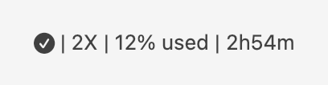
  &nbsp;&nbsp;
  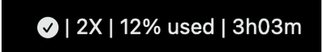
</p>

Click to open the full dashboard:

<p>
  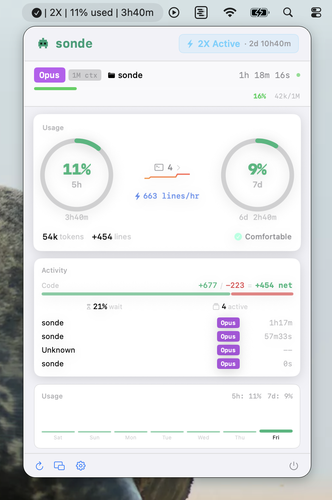
  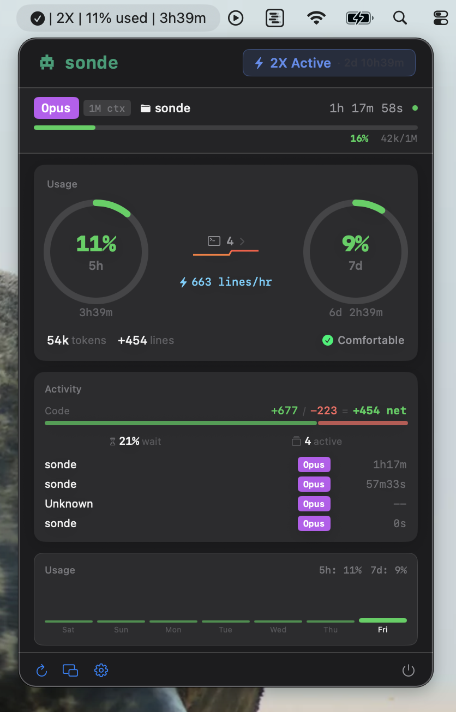
</p>

### Dashboard

| Feature | What it shows | What it means |
|---------|---------------|---------------|
| **Usage rings** | 5-hour and 7-day utilization with color-coded gauges | How much of your rate limit you've consumed in each window. Green = plenty left, red = near the limit |
| **Pacing tier** | Comfortable → On Track → Elevated → Hot → Critical → Runaway | Your burn rate. Comfortable means you can keep going all day. Hot means you'll hit your limit soon if you don't slow down |
| **Time-to-limit** | e.g. "At this rate, you'll hit your limit in ~2h 15m" | Prediction based on your current pace, accounting for active promotions |
| **Promo badge** | Active promotion status with countdown timer | Shows when Anthropic is running a capacity promotion and how long it lasts |
| **Active sessions** | All running Claude Code sessions with model, project, and duration | Every Claude Code instance currently running on your machine |
| **Code activity** | Lines added/removed, net change, wait percentage | How much code Claude has written this session and how much time you spent waiting |
| **7-day chart** | Daily peak usage bar chart with backfilled history | Sparkline showing your usage pattern over the past week |
| **Context bar** | Visual progress of your context window (e.g. 4k/1M) | How full your conversation context is. When it fills up, Claude loses earlier context |

### Projects view

Drill down from the dashboard to see usage broken out by project:

| Feature | What it shows | What it means |
|---------|---------------|---------------|
| **Project list** | Each project with model pill, token count, cache %, message count, task count | All your active Claude Code projects at a glance |
| **Token count** | e.g. "744.0k tokens" | Total tokens consumed by this project across all conversations |
| **Cache %** | e.g. "93% cache" | How efficiently Claude is reusing cached context. Higher is better (cheaper and faster) |
| **Messages** | e.g. "27 msgs" | Total back-and-forth messages in this project |
| **Tasks** | e.g. "1 tasks" | Number of active task lists in the project |
| **Last activity** | e.g. "10s ago" | When this project last had activity |

### Session detail view

Tap any project to see its full token economics:

| Feature | What it shows | What it means |
|---------|---------------|---------------|
| **Messages** | Total message count | How many messages have been exchanged in this project |
| **Activity** | Time since last activity | When Claude last responded |
| **Input tokens** | e.g. "824.0k" | Tokens sent to Claude (your prompts, code context, file contents) |
| **Output tokens** | e.g. "2.3k" | Tokens Claude generated (responses, code, explanations) |
| **Cache Read** | e.g. "771.7k" | Tokens served from cache instead of reprocessing. This is the savings |
| **Cache Write** | e.g. "52.2k" | New tokens written to cache for future reuse |
| **Cache Hit %** | e.g. "93%" | Percentage of input tokens that came from cache. Higher = more efficient |
| **Total tokens** | e.g. "826.3k" | Grand total across all token types |
| **Conversations** | Individual conversation list | Each conversation with its own token count, message count, and model used |

### Guided onboarding

First launch walks you through everything. Zero terminal commands.

<p>
  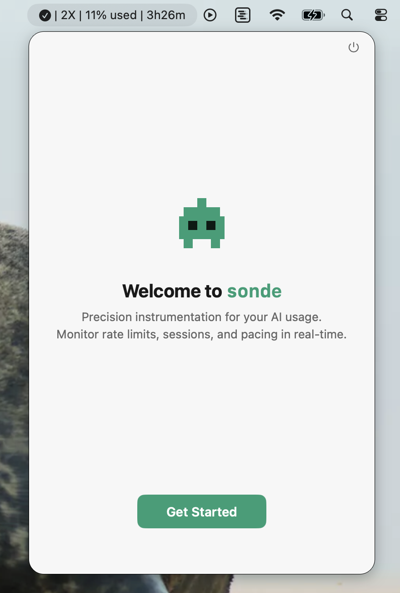
  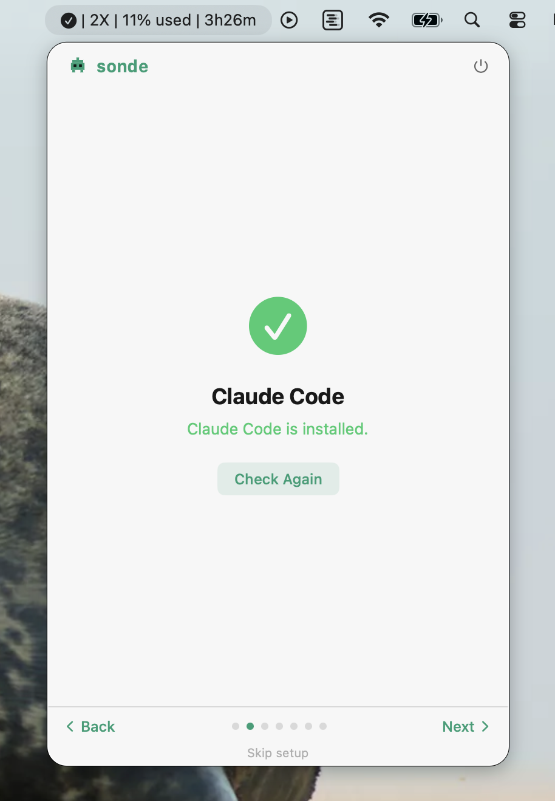
  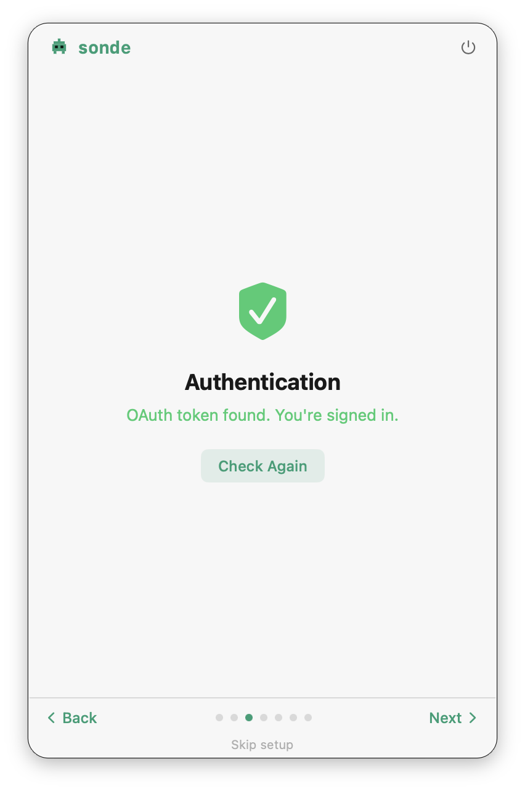
  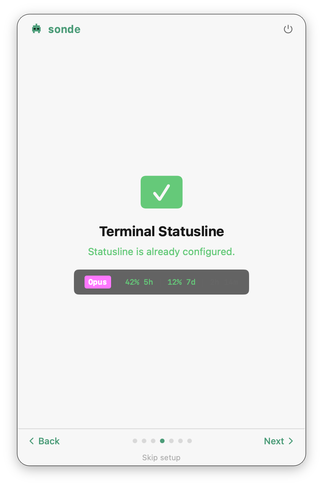
</p>
<p>
  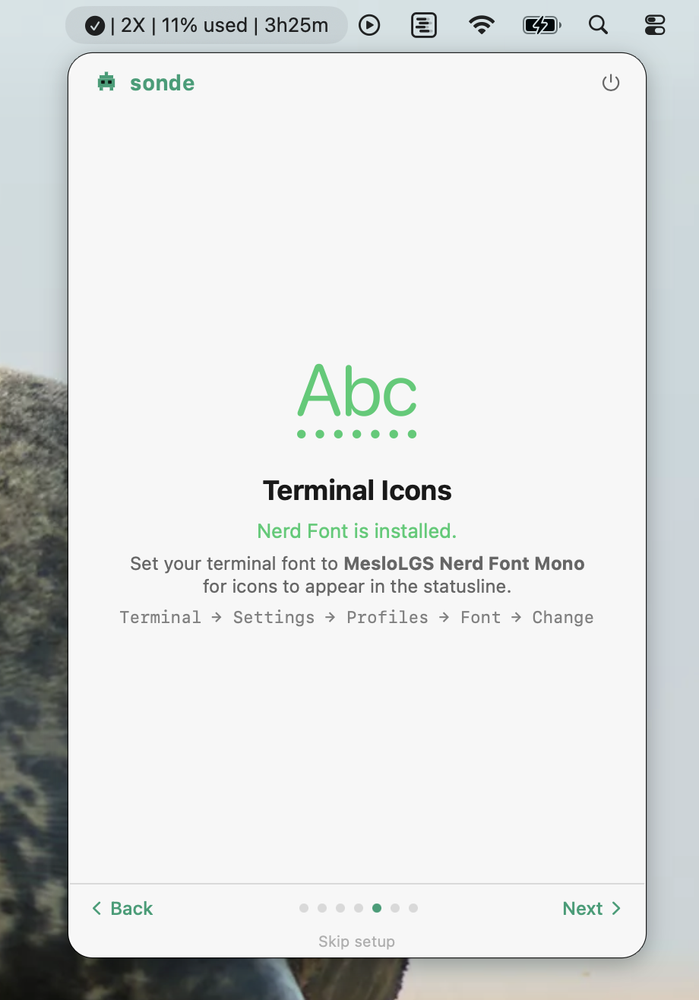
  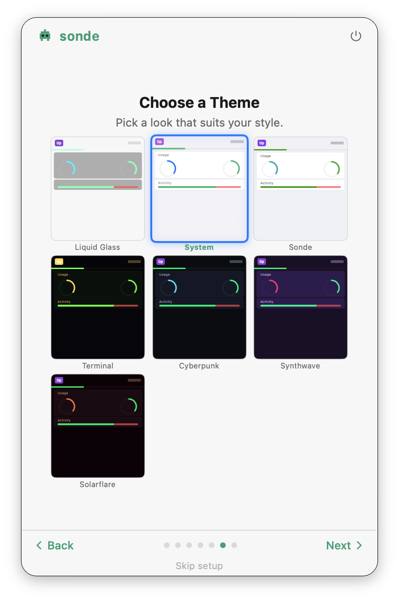
  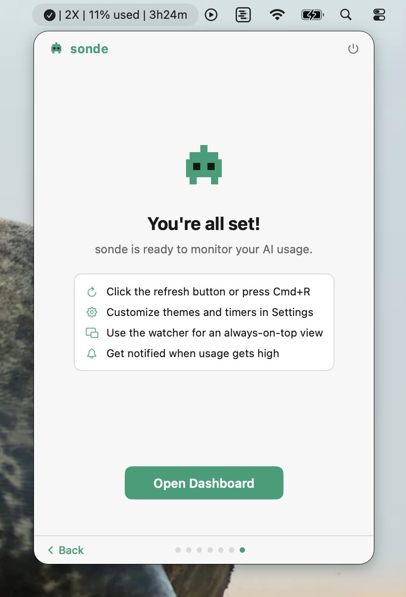
</p>

### Configurable menu bar

Every segment is toggleable in Settings. Pick your timer mode:

| Mode | Example |
|------|---------|
| 5h time left | `3h21m` |
| 5h elapsed | `1h39m` |
| 5h resets at | `2:30 PM` |
| 7d time left | `3d 12h` |
| 7d resets at | `Mon 8:00 AM` |
| Promo time left | `12h30m` |
| Session duration | `2h 14m` |

---

## The terminal statusline

A Rust-powered statusline that renders directly inside Claude Code:

<p>
  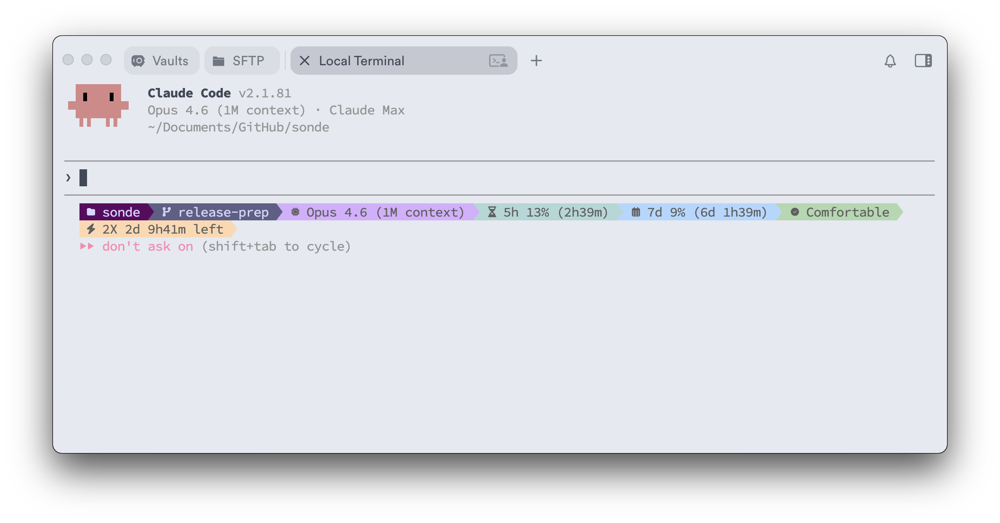
</p>
<p>
  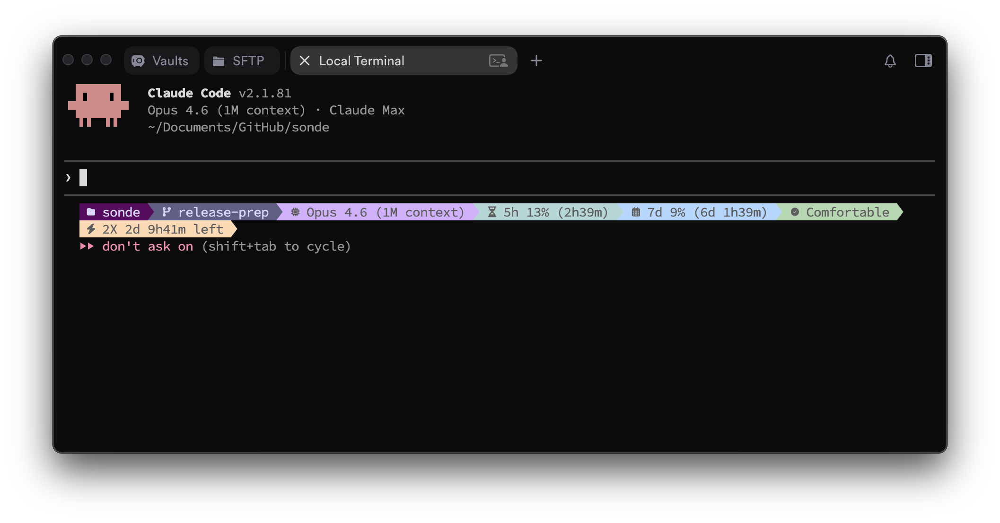
</p>

Every segment is a configurable module:

| Module | What it shows |
|--------|---------------|
| Project | Current project name |
| Git branch | Active branch |
| Model | Opus 4.6, Sonnet 4.6, Haiku 4.5 |
| 5h usage | Utilization + reset countdown |
| 7d usage | Weekly utilization + reset countdown |
| Pacing | 6-tier burn rate with time-to-limit |
| Promo badge | Active promotion status with countdown |
| Context bar | Visual progress bar of context window |
| Active sessions | Count of parallel Claude sessions |
| Session clock | Elapsed session time |

---

## Themes

### Menu bar app: 7 themes

Liquid Glass, System, Sonde, Terminal, Cyberpunk, Synthwave, Solarflare

| | | |
|:---:|:---:|:---:|
| 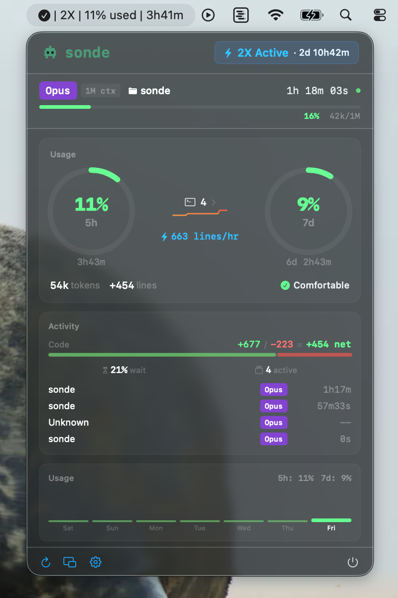<br>**Liquid Glass** | <br>**System Light** | <br>**System Dark** |
| 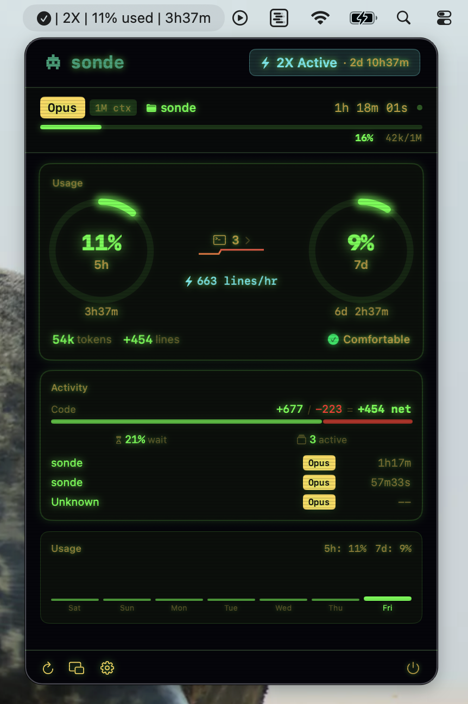<br>**Terminal** | 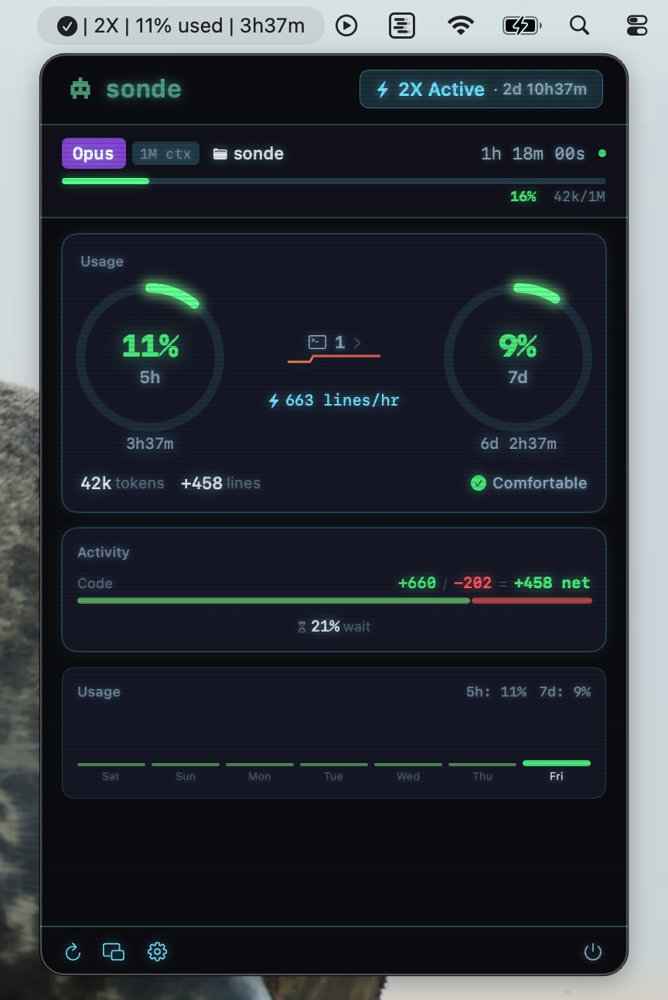<br>**Cyberpunk** | 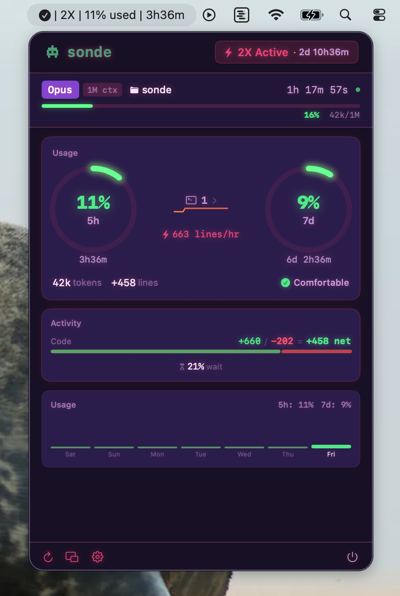<br>**Synthwave** |
| 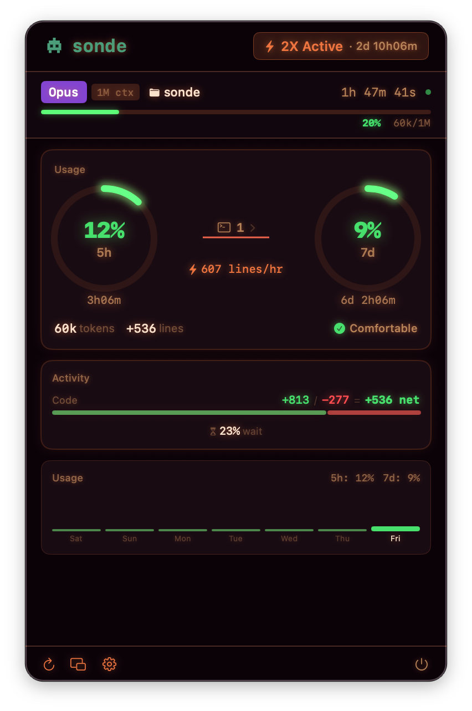<br>**Solar Flare** | 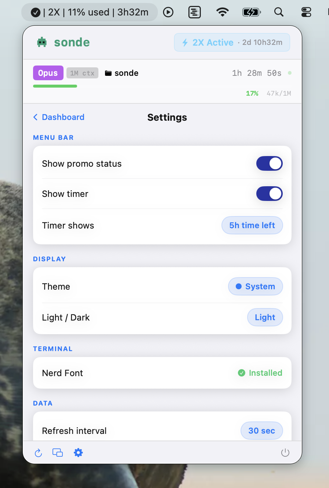<br>**Settings (Light)** | 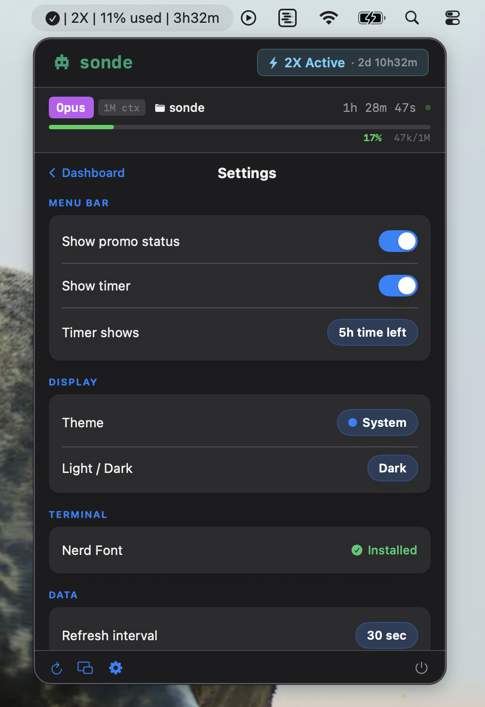<br>**Settings (Dark)** |

### Terminal: 6 powerline palettes

| Theme | Vibe |
|-------|------|
| **catppuccin-mocha** | Pastel on dark with mauve, sapphire, teal, peach |
| **terminal** | Phosphor green + amber CRT aesthetic |
| **cyberpunk** | Neon cyan + electric purple on deep navy |
| **synthwave** | Hot pink + lavender on midnight purple |
| **solarflare** | Fiery orange + solar yellow on deep red-black |
| **sonde** | Auto light/dark, the default theme |

```bash
sonde themes    # Preview all palettes in your terminal
```

Set in `sonde.toml`: `theme = "sonde"`. Options: catppuccin-mocha, terminal, cyberpunk, synthwave, solarflare, sonde (default).

Terminal themes match the menu bar app themes. Same names, same color palettes.

---

## Configuration

sonde looks for config in this order:

1. `$SONDE_CONFIG` environment variable
2. `./sonde.toml` (project-local)
3. `~/.config/sonde/sonde.toml` (XDG)
4. `~/.sonde.toml` (home fallback)

---

## Privacy and network

Sonde is local-first. No accounts, no telemetry, no analytics, no error reports.

### What goes over the network

| URL | When it's called | Why | How to disable |
|---|---|---|---|
| `api.anthropic.com/api/oauth/usage` | Only when Claude Code's stdin doesn't already provide `rate_limits` (older Claude Code, or before the first API response in a session). Cached 5 min. | Read 5h / 7d rate-limit utilization. **Does not consume tokens.** | Disable the usage modules in `sonde.toml`. |
| `promoclock.co/api/status` | Only when the promo badge module is enabled. 5-min cache. | Detect Claude Code capacity promotions. Third-party domain. Mostly vestigial since Anthropic permanently raised Pro/Max limits in May 2026. | `[sonde.promo_badge] enabled = false`. |
| `support.claude.com/...` | macOS menu bar app only, hourly | Scrapes Anthropic's promotion notice page. | Disable promo detection in the menu bar app settings. |
| GitHub releases API | Only when checking for updates | Update version comparison | Disable update checks in the menu bar app settings. |
| Discord / Slack webhook URLs | Only if you explicitly configure `[sonde.notifications] webhook_url = "..."` in a trusted config (see below) | Opt-in threshold alerts | Don't configure a webhook URL. |

Sonde **never** sends a paid request (`POST /v1/messages`) just to read your
own rate-limit data. An earlier version did fall back to such a "ping" when
the OAuth usage endpoint was rate-limited; that path has been removed.

### OAuth token handling

- On Claude Code v2.1.80+, Sonde does **not access the OAuth token at all** for
  rate-limit data on the statusline path — the harness provides `rate_limits`
  on stdin. The menu bar app still reads the token from the macOS Keychain on
  demand for richer views like `extra_usage`.
- When the token is needed, it is read from the keychain via
  `/usr/bin/security`, used for one HTTPS call, and dropped. Never logged,
  never written to disk, never cached in process memory beyond the request.

### Configuration sources and trust

Sonde looks for `sonde.toml` in this order:

1. `$SONDE_CONFIG` (trusted)
2. `./sonde.toml` (project-local — **untrusted by default**)
3. `~/Library/Application Support/sonde/sonde.toml` or `~/.config/sonde/sonde.toml` (trusted)
4. `~/.sonde.toml` (trusted)

**SECURITY**: a `sonde.toml` discovered in the current working directory could
have been planted by a third party (for example, in a repository you just
cloned). Since Sonde renders the statusline every prompt, two TOML sections
are dangerous if loaded from an untrusted source:

- `[sonde.custom.*] command = "..."` runs shell commands on every render.
- `[sonde.notifications] webhook_url = "..."` sends usage data to an arbitrary URL.

Sonde now **strips both sections** from project-local configs by default and
emits a warning. To opt in for a repository you actually trust, export
`SONDE_TRUST_LOCAL_CUSTOM=1` in your shell. Trusted config locations (env-var,
XDG, home) are not affected.

### Local writes

- `~/Library/Caches/sonde/` (macOS) or platform cache dir (Linux) — usage and
  promo caches, session data snapshots, optional webhook rate-limit state.
- `~/.claude/settings.json` — only when you run `sonde setup` or finish the
  menu bar app's onboarding wizard. Both make a timestamped `.bak` first.

---

## Commands

| Command | What it does |
|---------|-------------|
| `sonde` | Render statusline (reads JSON from stdin) |
| `sonde setup` | Auto-configure everything in ~10 seconds |
| `sonde doctor` | Run 9 diagnostic checks |
| `sonde themes` | Preview all 6 terminal palettes |
| `sonde version` | Print version |

---

## Roadmap

The current prioritized roadmap (with severity, source-cited findings, and
sequencing) lives in [`docs/audits/SONDE_ROADMAP.md`](docs/audits/SONDE_ROADMAP.md).

---

## License

MIT

---

<p align="center">
  Maintained by Ron Refael (<a href="https://github.com/ronrefael">@ronrefael</a>). Issues and PRs welcome.
</p>
